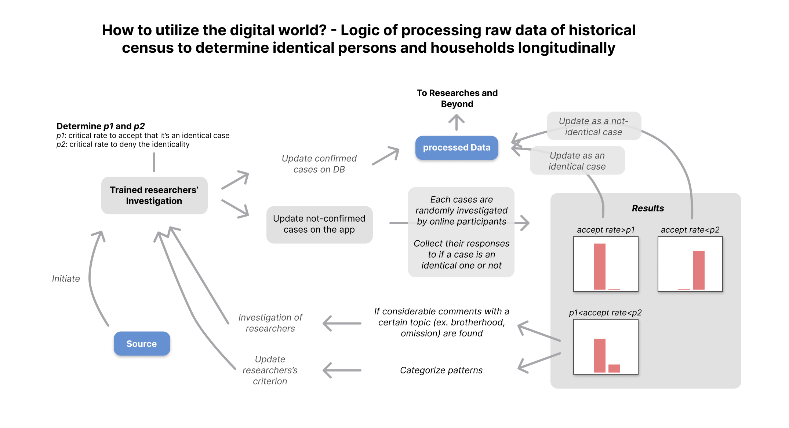

# ChosunPop-app Demo Look and Logic Proposed
*HoJeokDaeJang* is a census data of Chosun dynasty(Korea, 15th~19th Century). Although parts of the original data remain today, still considerable is the amount of the data.

Processing this historical census data is a challenge for modern researchers. One of the most chanllengeables is to investigate if a pair of two or more personnels and households from the longitudinal records is an identical one or not. And it's not very feasible for each researchers or teams of them do all the job with this historical super-duper big data.

Here is an idea to propose: Use the digital world. This is a cloned version of [Galaxy Zoo](https://en.wikipedia.org/wiki/Galaxy_Zoo). While Galaxy Zoo helps astronomers to determine types of galaxies from tons of observation data with voluntary participation from over the world, Here we can build an online site to determine identical persons from the historical census data with participation from over the (parts of the) world. The online based app also can boost up communication and co-works between research teams over the country.

A short video is a very ligtly implemented demo version of the app proposed here. It's built on Django - proves that building the app would be done in a day if there is any will and supports from the fields. Also a simple slice about the logic of the job follows.

##
https://github.com/acheul/chosunpop-app-lock/assets/72500819/13ec2e73-77cd-4d77-b0da-4ec51141e79d

